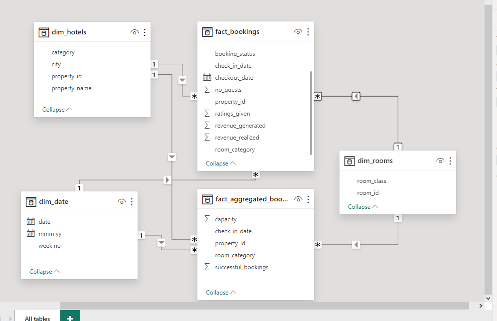
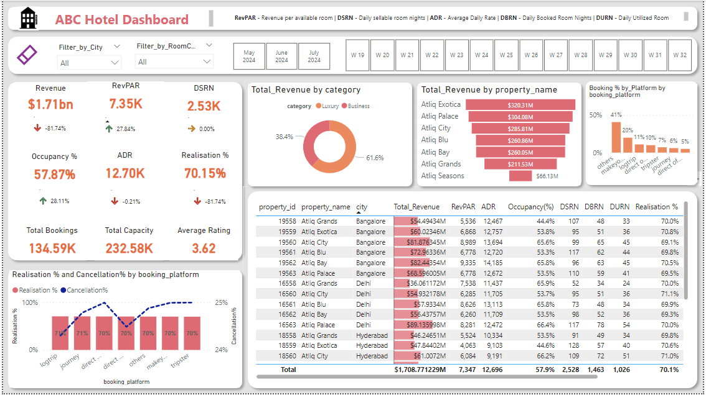
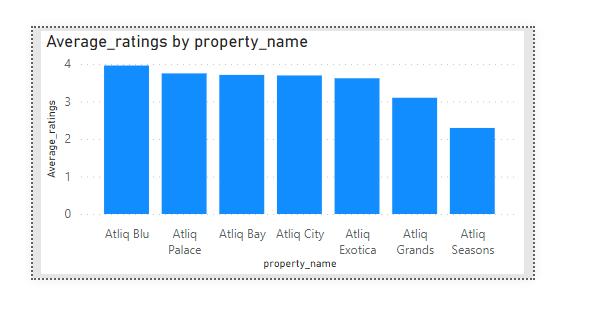
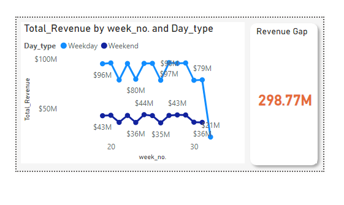

# Best_Hotels Data Analysis

## Introduction
This dashboard helps the hotel, delves into their revenue dynamics, gain a comprehensive understanding of revenue generation by the Hotel. It helps to provide insights into Key performance metrics (KPI) such as revenue per different filters, revenue per available room (RevPAR), room utilization and cancellation rates. By analyzing these metrics, we uncover trends, patterns, and then uncover factors influencing the hotel performance.

**_Disclaimer:_** All this dataset and reports do not represent any company, institution, or any company, but just a dummy dataset to demonstrate capabilities of Powerbi.

### Powerbi Concept applied
- Data Modelling: Star Schema
- Dax Concepts: Calculated measures, Calculated Column, if(), weeknum()
- Visuals: Card, Picart, Line Chart, Tables, Icon, Stacked column chats 

Dashboard link: https://app.powerbi.com/links/VnVTNU6CWb?ctid=7bfdaf73-929f-44a9-9c50-45e6724f145a&pbi_source=linkShare

## Problem Statement
- What is the gap between the total revenue generated and revenue realized, and what strategies can the hotel employ to optimize revenue realization?
- How does total revenue vary by category and property name and what methods can be implemented to maximize overall revenue?
- What are the Realization and cancellation rates across different booking platforms and how can the hotel mitigate cancellations rate to improve revenue stability?
- Visualize the Key Performance Indicator KPIs within the hospitality industry, indicate its performance difference between the previous week and the current week
- How does the total capacity of available room class compare to realization rate?

## New Skills Demonstrated
The following Power BI features were incorporated:

-	Adding tooltip,
-	Icon demonstration to show trends, 
-	Button.

## Data Sourcing

The data used is made up of 5 csv files. Extracted the files from a folder into Powerbi for analysis and Visualization. The folder contains 2 facts data and 3 dimensional data.

## Steps Followed

### Step 1: Load the Data
Load data into Powerbi desktop from a folder containing 5 csv files.

         From Get data button - More - Folder - select the folder the dataset is.
### Step 2: Data Transformation/Cleaning

Data was efficiently cleaned and transformed with Power query Editor of Powerbi.

- Clean the imported data in the power query editor to remove inconsistence column such as Removed Column Day_type that has the wrong weekday and weekend from dim date file. 
- Transform all the files as needed to ensure it is in the appropriate format, such as promoted headers, changed data type, create new calculated column such as:

 Week_no. to extract numbers alone from the week no that contain letters and number using the formular -

            **Week_no. = WEEKNUM(dim_date[date])**

new Day_type Column showing Sunday to Thursday as the Weekday and Friday to Saturday as the Weekend using the following formular - 

            **Day_type =
              var wkd = WEEKDAY(dim_date[date])
              RETURN if(wkd>5, "Weekend", "Weekday")**

### Step 3: Data Modelling

Powerbi automatically detected relationships, I manually created additional relationships, remove and replace unwanted relationship based on common keys required. 
This results in Star Schema relationship. 
The folder imported contains two fact_data and three dim_data CSV files.

### Step 4: Calculation Measures

Calculate Key Performance Indicators such as RevPAR, e.t.c. using DAX(Data Analysis Expression) formulas 
The below shows some of the DAX formula used

- Number of Days: To get the total number of days present in the data. In this case, we have data from May to July. So 92 days. 
                
                No of days = DATEDIFF(MIN(dim_date[date]),MAX(dim_date[date]),DAY) +1 

- Total cancelled booking: To get the "Cancelled" bookings out of all Total bookings happened 

                Total cancelled bookings = CALCULATE([Total Bookings],
                                                      fact_bookings[booking_status]="Cancelled")
- Booking % by Platform: To show the percentage contribution of each booking platform for bookings in hotels. We have booking platforms like makeyourtrip, logtrip, tripster etc)

                  Booking % by Platform = DIVIDE([Total Bookings],
                                               CALCULATE([Total Bookings],
                                                         ALL(fact_bookings[booking_platform])))*100"
- Revenue WoW change %: To get the revenue change percentage week over week. Here, revcw  for current week and revpw for previous week

                            Revenue WoW change % = 
                            Var selv =       IF(HASONEFILTER(dim_date[wn]),SELECTEDVALUE(dim_date[wn]),MAX(dim_date[wn]))
                            var revcw = CALCULATE([Revenue],dim_date[wn]= selv)
                            var revpw =  CALCULATE([Revenue],FILTER(ALL(dim_date),dim_date[wn]= selv-1))
                            return
                            DIVIDE(revcw,revpw,0)-1"

### Step 5: Analytics Visualization

1. The report comprises 9 reports: 
- Revenue trend and Revenue Gap       |      - Revenue Per Avalaible Room (RevPAR)
- Daily Sellable Room Night (DSRN)    |      - Occupancy Rate
- Average Daily Rate                  |      - Realisation
- Capacity and Realization Comparison |      - Average Rating
- Total Bookings
You can interact with the report [here]
2. Use Powerbi's built in visualization and custom visuals to create interactive dashboard and reports.
3. Utilize features such as Slicers for week number and Months+Year, filters by room_class and City and tool tips capabilities to allow users to explore the data and gain insights
4. Icon demonstration was used to visualize trends of week-on-week. To do this - Make use of tables, then rename for this visual and write the backend functions under cell element using if() function
   
               **if > 0 and < 1000 == up arrow icon
                 if > -1000 and < 0 == down arrow icon
                 if = 0 == right arrow icon**
5. A clear button was created to clear the filters or slicers used at once

## Final dashboard and other Necessary Visuals.

The dashboard presents Key Performance Indicator (KPIs) and metrics for the hospitality industry in a User-friendly interface. KPI cards with tooltips provide detailed explanations, while direction icons indicate trends, and the numerical values shows week-on-week comparison. A visual comparison of realization and cancellation rates across booking platform is available aiding in trend identification. A quick glance table summarizes all KPIs and metrics for efficient analysis, with filters and slicers enhancing insights.

The Visual display average rating by property name, with Aliq Blu achieving the highest rating and Atliq Seasons receiving the lowest among the seven properties. Interestingly, Atliq Exotica, despite boasting the highest revenue realization, maintain an average rating of 3.62, falling within the benchmark threshold of 3.5. However, Atliq Grand and Atliq Seasons fall below bench mark.

The visuals serve as tooltips, showcasing the trend of weekly revenue realization categorized by weekday and weekend. Additionally, it highlights a revenue gap of $298.77 million between generated and realized revenue.

## Conclusion & Recommendation

- The analysis reveals a significant gap of $298.77 million between the total revenue generated and the revenue realized. This indicates potential revenue leakage or inefficiencies. It is therefore recommended that the management should implement measures to streamline revenue collection processes, such as improving billing and payment systems, enforcing cancellation policies and enhancing staff training on revenue management practices.
- The luxury category accounts for 61.6% of total revenue realized, while the business category contributes 38.4%. Among the properties, Property Atliq Exotica has the highest revenue of $320.31 million, and Atliq Season has the lowest revenue of $66.13 million. Given that luxury category and Atliq Exotica property contributes a significant portion to the total revenue realized, the management should prioritize efforts to attract and retain luxury travelers and look for opportunities to increase revenue generated from business category, introducing exclusive packages or personalized experiences to appeal to business travelers.
- There is a negative correlation between cancellation rate and realization rate, indicating that higher cancellation rates are associated with lower realization rates. LogTrip and Journey booking platforms have the highest realization rates of 71% each, with relatively low cancellation rates of 24.3 and ... respectively. Other booking platform maintain a consistent realization rate of 70% but show a gallop increase in cancellation rates. It is therefore recommended that management should prioritized LogTrip and Journey booking platforms to maintain a high realization rates. For other booking platform implement targeted strategies to mitigate cancellation rates.
- The total revenue realized is $1.71 billion, The revenue per Available room (RevPAR) is $7.35 thousand, indicating the average revenue realized per available room, The Daily Utilized Room Nights (DSRN) is 2.53 thousand, representing the average number rooms utilized each day, The occupancy rate is 57.87% indicating the percentage of available rooms occupied during a specified period. The Average Daily Rate (ADR) is $12.70 thousand, representing the average rate charged per room. The realization percentage is 70.15% indicating the proportion of total bookings that results in revenue realization.
- There were 134.59 thousand total bookings made.
- The total capacity of available rooms is 232.58 thousand.
- The average rate of the hotel is 3.62.
- The elite room class has the highest capacity of 85,928 rooms with a realization rate of 70% while the presidential room class has the highest realization rate with 70.58% with a capacity of 27,140 rooms. It is recommended to enhance guest satisfaction and loyalty.  

# Thank you

